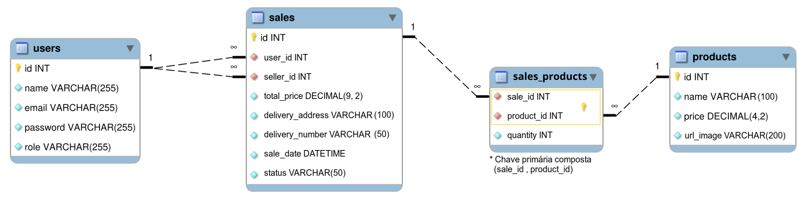
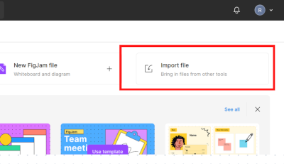
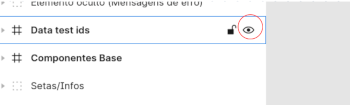

# Welcome to the Delivery App project repository

To carry out the project, pay attention to each step described below, and if you have any questions, send us via _Slack_! #vqv 🚀

Here you will find details on how to structure the development of your project from this repository, using a specific branch and a _Pull Request_ to place your codes.

---

## Terms of agreement

By starting this project, you agree to the guidelines of Trybe's Code of Conduct and Student Handbook.

# Deliverables

<details>
   <summary>
     <strong>🤷🏽‍♀️ How to deliver</strong>
   </summary><br>

- **Each group will have a specific branch** in the format `main-group-X`. Ex: `main-group-1`; `main-group-2`; etc;

- **To deliver your project you must create a `Pull Request` based on this repository in the format `[MAIN GROUP X] [BASE]`**. Your `Pull Request` must point from the `main-group-X` branch to the `main` branch (which will be your main PR) and must aggregate all of your group's work for evaluation at the end of development;

- **Each feature/fix/etc must be developed in a new branch**, whose format should preferably be `main-group-X-<change>-<specification>`. Ex: `main-group-1-feat-login-form`. This will help both your team and instructional staff locate their work on the project;

- **At the end of the project, each feature/fix/etc must be merged _(preferably via PR, with code review and approval from the entire group)_ with the group's main branch**, where the evaluation will take place. Ex: `main-group-1-feat-login-form` must be merged with `main-group-1`;

- **Each PR should preferably have a title in the format `[MAIN GROUP X] [CONTEXT] [CHANGE] [DESCRIPTION]`**. Ex: `[MAIN GROUP 1] [API] [FEAT] [LOGIN]`; `[MAIN GROUP 1] [FRONT] [FEAT] [LOGIN-FORM]`; etc. This will help both your team and instructional staff locate their work on the project.

   > Remember that you can consult our content on [Git & GitHub](https://app.betrybe.com/learn/course/5e938f69-6e32-43b3-9685-c936530fd326/module/fc998c60-386e-46bc-83ca -4269beb17e17/section/fe827a71-3222-4b4d-a66f-ed98e09961af/day/35e03d5e-6341-4a8c-84d1-b4308b2887ef/lesson/573db55d-f451-455d-bdb5-66545668 f436) and our [Blog - Git & GitHub](https ://blog.betrybe.com/tecnologia/git-e-github/) whenever you need it!

</details>

<details>
   <summary>
     <strong>👨‍💻 What should be developed</strong>
   </summary><br>

   This will be your most complete project yet! In this application, your group will be responsible for creating and integrating both the back-end and front-end, creating a beer delivery platform. 🍻

   The project is not just about coding, but also about working as a team, learning and having a lot of fun!

   **In this project, your group must develop a delivery app for a beverage distributor. See below the context of the delivery that must be made:**

   Dona Tereza's beer distributor is becoming computerized! 🚀 Your business, previously focused on a specific location in the city, started receiving a massive amount of orders from other points, expanding its operations via delivery. This is all thanks to the excellent price of drinks and service from the sales team.

   Now the distributor has some points of sale in the city to speed up service in these areas. Each point of sale, in turn, has a responsible sales person.

   As her old system, which was a set of spreadsheets, no longer meets the needs of the business as it generates a lot of maintenance, Ms. Tereza approached her team of developers with an idea for an application that could streamline the lives of her team and the people they work with. buy your products. The application needs:

- Have access via login: both customers and sellers, as well as Ms. Tereza herself, who manages the system, must have access to the application via login, but for different functions: (1) The customer, who purchases from the product list ; (2) The selling person, who approves, prepares and delivers; (3) The administrator person, who manages who uses the application;
- Communicate between customers and salespeople: the customer places the order via the "shopping cart" and the salesperson approves, prepares and sends the order. When the product is received by the person who purchased it, that person marks the order as "received". Both must have details about their requests;
- If the customer places the order, it should appear to the seller in their order dashboard after updating the page. The customer, in turn, must have information about their order when their page is updated, that is, have information whether the order is being prepared or has already been delivered;

His team, which already has good development experience, quickly presented a [prototype](#construcao-do-front-end-e-componentizacao) and an [ER Diagram](./assets/readme/erdr. png) as shown in the image:

   

   His team's idea already presupposes some scalability, given that some generic entities were established in the database and componentization in the front-end, so that, if the system grows, it wouldn't be too difficult to change and expand this structure.

   **The proposal was enchanting, but Ms. Tereza wants to see the business in action! She is willing to pay for an MVP of the project and you closed the deal with an agreed deadline for delivery.**

   Now it's time to get to work! Let's start?

</details>

<details>
   <summary>
     <strong>🗓 Delivery Date</strong>
   </summary><br>
  
- This project is a group project;
- There will be `13` days of project;
- Delivery date for regular project evaluation: `25/05/2023 14:00`.

</details>

# Guidelines

<details>
   <summary>
     <strong>‼️ Before you start developing</strong>
   </summary><br>

   1. Clone the repository

- Use the command: `git clone git@github.com:tryber/sd-025-b-project-delivery-app.git`.
- Go to the repository folder you just cloned:
   - `cd sd-025-b-project-delivery-app`
- Go to your group's branch, with `git checkout main-group-XX && git pull`, where `XX` is your group number. Examples: `main-group-1`, `main-group-22`.

   2. Install dependencies

- To do this, use the following command: `npm install`

   3. Make changes separated by new branches, created from the `main-group-XX` branch. Remember to create a new branch for each demand.

- Make sure you are on the `main-group-XX` branch
   - Example: `git branch`
- If not, switch to the `main-group-XX` branch
   - Example: `git checkout main-group-XX && git pull`
- Now, create a branch for the demand you will develop for your project
   - You must create a branch with a brief description of the demand to be developed
   - Example: `git checkout -b main-group-XX-create-input-field`

   4. Add changes to Git _stage_ and `commit`

- Check that the changes are not yet in _stage_
   - Example: `git status` (new changes should be listed in red)
- Add the new file to Git _stage_
   - Example:
     - `git add .` (adding all changes - _that were in red_ - to the Git stage)
     - `git status` (the file _joaozinho/README.md_ should appear listed in green)
- Make the initial `commit`
   - Example:
     - `git commit -m 'starting project x'` (making the first commit)
     - `git status` (a message like _nothing to commit_ should appear)

   5. Add your branch with the new `commit` to the remote repository

- Using the previous example: `git push -u origin main-group-XX-creates-input-field`

   6. Create a new `Pull Request` _(PR)_

- Go to the [GitHub repository](https://github.com/tryber/sd-025-b-project-delivery-app/pulls) _Pull Requests_ page
- Click on the green _"New pull request"_ button
- Click on the _"Compare"_ checkbox and choose the group branch, `main-group-XX`, and your branch **carefully**
- Put a title for your _Pull Request_
   - Example: _"[GROUP XX] Create search screen"_
- Click on the green _"Create pull request"_ button
- Add a description for the _Pull Request_ and click the green _"Create pull request"_ button
- **Don't worry about filling out anything else for now!**
- Go back to the [repository's _Pull Requests_ page](https://github.com/tryber/sd-025-b-project-delivery-app/pulls) and check that your _Pull Request_ is created

7. Once approved by at least two people in your group and with _Linter_ approved, access **YOUR** _Pull Request_ and click on the _"Merge pull request"_ button

</details>

<details>
   <summary>
     <strong>⌨️ During development</strong>
   </summary><br>

- Make `commits` of the changes you make to the code regularly;

- Remember to always update the remote repository after one (or a few) `commits`;

- The commands you will use most frequently are:
     1. `git status` _(to check what is in red - out of stage - and what is in green - on stage)_
     2. `git add` _(to add files to the Git stage)_
     3. `git commit` _(to create a commit with the files that are in the Git stage)_
     4. `git push -u origin branch-name` _(to push the commit to the remote repository the first time you `push` a new branch)_
     5. `git push` _(to push the commit to the remote repository after the previous step)_

</details>

<details>
   <summary>
     <strong>🤝 After finishing development (optional)</strong>
   </summary><br>

   To signal that your project is ready for _"Code Review"_, do the following:

- Go to the **YOUR** _Pull Request_ page, add the _"code-review"_ label and tag your colleagues:

   - In the menu on the right, click on the _link_ **"Labels"** and choose the _label_ **code-review**;

   - In the menu on the right, click on the _link_ **"Assignees"** and choose **your username**;

   - In the menu on the right, click on the _link_ **"Reviewers"** and type `students`, select the team `tryber/students-sd-025-b`.

   If you have any questions, [here is an explanatory video](https://vimeo.com/362189205).

</details>

<details>
   <summary>
     <strong>🕵🏿 Reviewing a pull request</strong>
   </summary><br>

   Use the content about [Code Review](https://app.betrybe.com/learn/course/5e938f69-6e32-43b3-9685-c936530fd326/module/f04cdb21-382e-4588-8950-3b1a29afd2dd/section/b3af2f05-08e5 -4b4a-9667-6f5f729c351d/lesson/36268865-fc46-40c7-92bf-cbded9af9006) to help you review _Pull Requests_.

</details>

<details>
   <summary>
     <strong>🪛 Relevant scripts from main <code>package.json</code></strong>
   </summary><br>

   **Note:** in this project, we use the `pm2` process manager. If you want to better understand what Node process managers are, check out [this link](https://app.betrybe.com/learn/course/5e938f69-6e32-43b3-9685-c936530fd326/module/f04cdb21-382e -4588-8950-3b1a29afd2dd/section/c2647acd-7619-4c8a-a7d8-13b452281c35/lesson/99c92a3a-8b45-4428-8ed6-c1c8a7ffdeac).

   **These are the scripts from the project root (`./package.json`) and not from the individual applications `./front-end/package.json` and `./back-end/package.json`**:
   
   - `start`: Cleans ports `3000` and `3001` and simulates initialization in the evaluator. It also prepares the field by running `Sequelize` to restore the **test database** (final `-test`) and uploads the application with `pm2` in `fork` mode (one instance for each application). In this mode, changes are not watched;
   - *use (in the project root): `npm start`*

- `stop`: Stop and delete applications running in `pm2`;
   - *use (in the project root): `npm stop`*

- `dev`: Cleans ports `3000` and `3001` and uploads the application with `pm2` in `fork` mode (one instance for each application). In this mode, updates are watched (`watch` mode);
   - *usage (in the project root): `npm run dev`*

- `dev:prestart`: From the root, this command performs the process of installing dependencies (`npm i`) in both projects (`./front-end` and `./back-end`) and runs the `Sequelize` in `./back-end` (remember to configure `.env` in it);
   - *usage (in the project root): `npm run dev:prestart`*

- `db:reset`: Run the `Sequelize` scripts restoring the **development database** (final `-dev`). Use this script if there is a problem at your local bank;
   - *usage (in the project root): `npm run db:reset`*

- `db:reset:debug`: Runs the `Sequelize` scripts restoring the **development database** (final `-dev`). Use this script if there is a problem at your local bank. This command is also capable of returning detailed error information (when they occur in the process);
   - *usage (in the project root): `npm run db:reset:debug`*

- `test <filenames>`: Runs all tests (or a part of them if `<filenames>` is defined) using the **test database** (final `-test `);
   - *use (in the project root): `npm test`, `npm test 01login 02register` or `npm run test 01 02`*

- `test:dev <filenames>`: Runs all tests (or a part of them if `<filenames>` is defined) using the **development database** (final ` -dev`);
   - *use (in the project root): `npm run test:dev`, `npm run test:dev 01login 02register` or `npm test:dev 01 02`*;

- `test:dev:open <filenames>`: Runs all tests (or a part of them if `<filenames>` is defined) using the **development database** ( final `-dev`), example `npm test:dev:open 01login 02register` or `npm test:dev:open 01 02`. This test should open a window showing the behavior of the pages;
   - *use (in the project root): `npm run test:dev:open`, `npm run test:dev:open 01login 02register` or `npm test:dev:open 01 02`*;

- `test:dev:report "<filenames>"`: Runs all tests (or a part of them if `"<filenames>"` is defined) using the **database development** (final `-dev`). This test returns a text output with the results of all tests. `logs` are generated in `./__tests__/reports`.
   - *use (in the project root): `npm run test:dev:report`, `npm run test:dev:report "01login 02register"` or `npm run test:dev:report "01 02"`*;

</details>

<details>
   <summary>
     <strong>🎛 Linter</strong>
   </summary><br>

##ESLint

   To perform static analysis of your code in this project, we will use the [ESLint](https://eslint.org/) linter. This way the code will be aligned with good development practices, being more readable and easier to maintain!

   ➡️ This project already comes with dependencies related to _linter_ configured in the `package.json` files in the following paths:
     - `sd-025-b-project-delivery-app/back-end/package.json`
     - `sd-025-b-project-delivery-app/front-end/package.json`

   ➡️ To be able to run `ESLint` simply:

- Run the `npm install` command within the project, individually, that is, run this command within the `back-end` folder and also in the `front-end` folder;

- Then run the `npm run lint` command within each of these folders, so you can check the particularities individually;

- If `ESLint` analysis finds problems in your code, they will be shown in your terminal.
- If there is no problem in your code, nothing will be printed on your terminal.

- You can also install the `ESLint` plugin in `VSCode`. To do this, just go to extensions and download the [`ESLint` plugin](https://marketplace.visualstudio.com/items?itemName=dbaeumer.vscode-eslint).
  
   👀 **Keep an eye on the tip**: open each project folder separately (`back-end` and `front-end` in separate VSCodes, to take advantage of each project's individual `ESLint`).

   ⚠️ **Important**: Due to the fact that the `ESLint` rule configurations of the front and back projects are different, it is necessary to run `ESLint` in each project.

## StyleLint

➡️ We will also use [StyleLint](https://stylelint.io/) to carry out static analysis of your code, especially in Front-end.

   ➡️ To be able to run `StyleLint` in a project, simply:

- Run the `npm install` command within the front-end project;

- Then run the command `npm run lint:styles`;

- If `StyleLint` analysis finds problems in your code, such problems will be shown in your terminal;
- If there is no problem in your code, nothing will be printed on your terminal.

   ➡️ If you still have any questions, you can consult our content on [`ESLint`](https://app.betrybe.com/learn/course/5e938f69-6e32-43b3-9685-c936530fd326/module/f04cdb21-382e-4588 -8950-3b1a29afd2dd/section/3b1546b5-f7bc-40f7-a674-77b16c408756/lesson/0c9e8c0e-24c3-4526-ba6b-60d95913e022)

   ⚠️ **Important**: Stylelint is only applicable on the front-end.

   > ⚠️ **Important**: Pull Requests with Linter issues will not be evaluated. Be careful to resolve them before finalizing the development.

</details>

<details>
   <summary>
     <strong>🛠 Tests</strong>
   </summary><br>

   **⚠️ Attention: The automatic evaluator does not necessarily evaluate your project in the order in which the requirements appear in the readme. This is to make the evaluation process faster. So don't be alarmed if this happens, okay?**

</details>

</details>

<details>
   <summary>
     <strong>🏦 Database and Sequelize</strong>
   </summary><br>

## Database

   For the database, we will use the `Sequelize` ORM, which will interface with `MySQL`. To do this, pay attention to the following guidelines:

- Use the file `./db.example.sql` for reference when creating `migrations` and `seeders`;
- [ER Diagram](./assets/readme/erdr.png) can also help to "visualize" the database;
- Respect the database structure, that is, your implementation **should not** add or remove tables, fields or relationships and your API must be prepared to take full advantage of this structure.

## Sequelize

   ⚠️ **Sequelize configuration can be considered the zero requirement of the project**, given that most tests depend on the structure of some table for testing, **therefore, it must be done first**.

   ⚠️ Before starting the project, ensure that Sequelize runs correctly in `./back-end` (at the root of the project, the command `npm run db:reset` will be of great help, as it is used to restore the database ` -dev`). The evaluator will execute sequelize functions to ensure the database structure.

   The project already provides an initialized ORM structure (in `./back-end/src/database`). Here, it is necessary that you develop the **migrations** and **seeders** correctly, following the model in `./db.example.sql` (this file serves as a reference, and has no influence on the application or assessment).

   ⚠️ The evaluator will use `default` values in the file `./back-end/src/database/config/config.js`, which is already included in the project if nothing is defined. Therefore, be careful when making any changes to this file, as it is through this file that the evaluator will use the correct database references for each situation (development and testing).

- This project provides by default the `.sequelizerc` file in `.back-end` for folder pattern settings in Sequelize.

- **Optionally in local development, you can change the `EVAL_ALWAYS_RESTORE_DEV_DB` value of the `.env` file in `./back-end` to `false`**, which will persist local test data throughout the test. This option can have implications for the performance and reliability of the local test, as the evaluator may behave badly if there is a large number of records to evaluate. If a problem occurs, use the command `npm run db:reset` or `npm run db:reset:debug` (to find errors) from the project root to restore the database, or change the `EVAL_ALWAYS_RESTORE_DEV_DB` option back to ` true`.

</details>

<details>

summary>
     <strong>🏗️ Preparing the field and starting the project</strong>
   </summary><br>

- ⚠️ The project only installs dependencies with version 16 of `node` to avoid version conflicts, if you don't have this version installed you can use [`nvm`](https://github.com/nvm-sh/ nvm#installing-and-updating) to manage versions.

- ⚠️ The complete evaluation process is quite time-consuming (around 20 minutes), so **it is important that the tests are carried out in parts, locally, before being sent to the evaluator!**. To do this, use the local test commands (`npm run test:dev*`) presented in relevant scripts of the main `package.json`!

     ▶️ Example: After finishing the requirements of the first file (`01login.test.js`), you can use the command `npm run test:dev 01` or `npm run test:dev:open 01` (if you want to view) to test that part of the project.

     ▶️ Here, you are also free to use the `.only` or `.skip` commands to validate specific tests in the local evaluator (`./__tests__/end-to-end` folder), example:

```js script
/*
  
  - ⚠️ **IMPORTANT**: this device **should not be "committed" to the project, at risk of disqualification in the evaluation**, but it can be used to save time in the local test.
*/

describe(requirement(1), () => {
   test.only("The evaluator will navigate to the host address using the '/' endpoint", async () => { // `test.only` must run the specific test for requirement 1 and skip the others
     // ...
   });
});
```

- ⚠️ **For local tests, it is essential to configure the environment variables file `.env` (from `environment`) inside the `./back-end`** folder (it is the only `.env` in the project ), as per the example in `.env.example`, in the same folder. This file will serve as a reference for the evaluator and if it does not exist, the evaluator will use `default` values for the process (Which may cause an error in the local test, if its settings are not the same).

- ⚠️ **Exceptionally in this project, there is a need to maintain and upload the `jwt.evaluation.key` file to the repository, which must also be in `./back-end`**. This file must contain solely and exclusively the key used for encryption with JWT, which will also be tested by the evaluator. In this sense, this file can be read by your application when working with `tokens`.

- ⚠️ **Start the project from the root, using the `npm i`** command. After that, it is possible to install both applications (back and front) through the project root, using the command `npm run dev:prestart` (this command will also restore the database, if `.env` is correctly configured).

</details>

<details>
   <summary>
     <strong> ℹ️ Project Data-testids</strong>
   </summary><br>

   Pay attention to the following points:

- The `data-testid` of each element that will be used in the project evaluation is in the file [data-testids.txt](data-testids.txt) in the project root.
- In [figma prototype](#construcao-do-front-end-e-componentizacao), there is a number in the elements associated with `data-testids`. You can, through the prototype, identify the number and then search the file [data-testids.txt](data-testids.txt) for the corresponding `data-testid`, [as in the example](./assets/readme/data- test-figma-txt.png).
- ⚠️ **Attention:** To pass the evaluator, the `strings` that form each `data-testid` cannot break lines, not even in literal templates. One suggestion is to create constants for parts of the string and then concatenate them, as in the example:

     ```js script
    
     const ROUTE = 'customer_products';
     const ELEMENT = 'element-navbar-link-products';

     <p data-testid={ `${ROUTE}__${ELEMENT}` }>Example</p>
     ```

   👀 **Keep an eye on the tip**: you can read more about the `data-*` attributes [in this link](https://developer.mozilla.org/pt-BR/docs/Learn/HTML/Howto/Use_data_attributes ).

</details>

<details>
   <summary>
     <strong>👷 Project structuring</strong>
   </summary><br>
   
   To facilitate understanding, we can divide the application into **4 main flows**, **a status validation between customer and sales person** and **test coverage (`front-end` and `back-end`) **:

- **Common Flow** which comprises:
   - (1) Login Screen (`01login.test`);
   - (2) Registration Screen (`02register.test`).

- **Customer Flow** which includes:
   - (3) Products Screen (`03customer_products.test`);
   - (4) Checkout Screen (`04customer_checkout.test`);
   - (5) Orders Screen (`05customer_orders.test`);
   - (6) Order Details Screen (`06customer_order_details.test`).

- **Selling Person Flow** which comprises:
   - (7) Orders Screen (`07seller_orders.test`);
   - (8) Order Details/Control Screen (`08seller_order_details.test`).

- **Order Status Validation** which includes:
   - (9) Status test (`09customer_seller_status_sync.test`);

- **Administrator Person Flow** which comprises:
   - (10) User management screen (`11admin_manage_users.test`).

- **Application tests** which includes:
   - (11) Coverage tests (`12coverage_tests.test`).

- ⚠️ **Important** ⚠️: the login screen must be able to direct to the main screen of each user, the pages being:
   - From customer: `/customer/products`,
   - From the seller: `/seller/orders`,
   - From the administrator: `/admin/manage`

</details>

<details id="construcao-do-front-end-e-componentizacao">
   <summary>
     <strong>🎨 Front-end Construction and Componentization</strong>
   </summary><br>

## Front-end construction

- Use the file [`prototype.fig`](./prototype.fig) contained in the root of the project to guide you in building the front-end. This is a Figma file that contains a base layout and the data-testids for each element.

   ⚠️**Important**: to view the prototype, you must log in to [Figma](https://www.figma.com/) and import the file. The data-testids are arranged in the balloons. If you want to hide them to view the prototype cleanly, you can hide the `data-testids` layer by clicking the "eye" icon next to its name. If you have any questions, check out the images below:

   

   

- To serve static files as images in the back-end, use the following path:`./back-end/public`;
- ⚠️**Important**: our image bank can be [downloaded here](./assets/images.zip);

## Componentization

   Our **prototype** has a set of **base components**. This is on purpose and suggests that it is essential that you componentize the front-end in such a way that it is possible to make the greatest possible reuse of each structure.

   It's good to remember that **a front-end in React with little componentization generates a lot of maintenance over time and delays delivery**. Here, it is advisable to think using an [atomic model](https://brasil.uxdesign.cc/atomic-design-redesenhando-os-entreg%C3%A1veis-de-designers-e-desenvolvedores-da8886c7258d) of development.

</details>

<details>
   <summary>
     <strong>🤲 Writing your tests</strong>
   </summary>
  
- ⚠️ The project will separately evaluate the test coverage of the _front-end_ application and the _back-end_ application, that is, it is necessary to implement the test files for each part of the application, both _front-end_ and _back-end_.
- This project does not evaluate the type of test implemented, that is, whether it is _unit test_ or _integration test_. Both apply to the project, and it is up to each group or individual to decide which type of test to apply, and they can even use the two complementaryly. Therefore, evaluative tests will only measure coverage (_coverage_) by number of lines and percentage.
- Write unit tests and feel free to change the UI. However, respect the `data-testid` attributes, as they will be used to correct the project.
  
</details>
  
<details>
   <summary>
     <strong>⚠️ File upload</strong>
   </summary>

- If you need to upload a file/image, you can use the tool/technology of your choice, we highlight it here:
   - [Express Static](https://expressjs.com/pt-br/starter/static-files.html), a simple and practical tool, already integrated with express to serve static files.
   - Multer, a more complete tool about which we have content in [Real Life Engineer](https://app.betrybe.com/learn/course/5e938f69-6e32-43b3-9685-c936530fd326/module/f04cdb21- 382e-4588-8950-3b1a29afd2dd/section/2b8cf38c-5587-4e1d-9778-9083ed02d3f2/lesson/2300b1ee-d7d9-40f1-8d0d-67c4b3cd725b).

</details>

<details>

<summary>
     <strong>🔄 Persistence in LocalStorage</strong>
   </summary>
  
   - To persist information such as products in the cart, consider:
     - If you are using [redux](https://redux.js.org/), use [redux-persist](https://github.com/rt2zz/redux-persist), a library that persists the state of your application in localStorage automatically.
     - If you are using [context](https://reactjs.org/docs/context.html), create a custom hook to isolate the persistence logic from the rest of your code, as suggested [in this article](https: //jdudzik.medium.com/persistent-data-with-react-hooks-and-context-api-3f3f18ce947). You can find different suggestions and strategies by searching for something like: `react context persist`.
  
</details>

<details>
   <summary>
     <strong>🗣 Give us feedback on the project!</strong>
   </summary><br>

   When finalizing and submitting the project, don't forget to rate your experience by filling out the form. **Takes less than 3 minutes!**

   Link: [Project evaluation form](https://be-trybe.typeform.com/to/ZTeR4IbH#cohort_hidden=CH25-B&template=betrybe/sd-0x-project-delivery-app)

</details>

<details>
   <summary>
     <strong>🗂 Share your portfolio!</strong>
   </summary><br>

   Did you know that LinkedIn is the main professional social network and sharing your learning there is very important for anyone who wants to build a successful career? Share this project on your LinkedIn, tag Trybe's profile (@trybe) and show your network its evolution.

</details>

# Requirements

## `Common Flow`

The Common Flow must ensure that it is possible to **login** and **register** to the system.

>⚠️ **In this project there is the file `back-end/jwt.evaluation.key` which must be read and used as the `secret` to perform the encryption of _tokens_, thus eliminating the need to create an environment variable to that.**

---

### `01login.test`

All tests in this file:

- They will check if the database contains the standard users (as referenced in `db.example.sql`);
- They will navigate to the main page at `localhost:3000/login`.

---

#### 1 - Create a login screen that must be accessible via the / and /login endpoints in the browser

**Technical observations**

- Here you must ensure that the application has access to a `/login` route;
- The default route (`/`) must redirect to the `/login` route.

<details>
   <summary>
     <b>What will be evaluated</b>
   </summary>

- The evaluator will navigate to the host address using the `/` endpoint;
   - The evaluator will check the redirection to the `/login` page;
- The evaluator will navigate to the host address using the `/login` endpoint.

</details>

---

#### 2 - Create the login screen elements with the data-testids available in the prototype

**Technical observations**

- Guide yourself through the following prototype screen: [`Comum / Login`](#construcao-do-front-end-e-componentizacao);

<details>
   <summary>
     <b>What will be evaluated</b>
   </summary>

- The evaluator will look for the fundamental elements for the other tests.

</details>

---

#### 3 - Design the login screen in such a way that it makes it impossible to log in with poorly formatted data

**Technical observations**

- The password can be any type of character;
- Here, the criteria for considering **poorly formatted** login data are:
   - Incomplete email, outside a common pattern such as: `<email>@<MainDomain>.<GenericDomain>`;
   - Password with a number of characters less than `6`.

<details>
   <summary>
     <b>What will be evaluated</b>
   </summary>

- The evaluator will test 3 different random situations (one for each validation) in isolation, one of which is valid;
- The evaluator will test your form with the 3 situations sequentially;
- The evaluator will not log in using the login button, he will validate whether the button will be enabled or not, depending on the criteria during data entry;
- It is expected that data will be validated during writing.

</details>

---

#### 4 - Design the login screen in such a way that it makes it impossible to log in with non-existent data in the database

**Technical observations**

- Your page must be able to alert the user that the login is invalid after their attempt, since despite being formatted correctly, the data does not exist in the database.

<details>
   <summary>
     <b>What will be evaluated</b>
   </summary>

- The evaluator will attempt to log in via the login button, with valid random data;
- The evaluator expects there to be a `POST` request to the API, which returns the status `404 - Not found`;
- The evaluator must identify that the page address has not been changed;
- The evaluator waits for an element, previously hidden, to appear on the screen with some error message.
   - Element: `common_login__element-invalid-email`

</details>

---

#### 5 - Develop the login screen so that it makes it possible to log in with valid data that exists in the database

**Technical observations**

Your page must be able to use the customer data provided in `db.example.sql`:

- Note that the password stored in the bank is a [`hash md5`](https://pt.wikipedia.org/wiki/MD5), whose translation is also commented in the file;
- Your API must be able to translate a common password into an `md5 hash`, comparing and validating it with that of the database;
- It is possible to use third-party libraries such as [`md5`](https://www.npmjs.com/package/md5) or the native [`crypto`](https://nodejs.org/api/crypto. html#crypto_crypto_createhash_algorithm_options), for converting values to `md5`.

<details>
   <summary>
     <b>What will be evaluated</b>
   </summary>

- The evaluator will try to perform the login action with valid data. **This test assumes the validity of previous tests**;
   - The evaluator will use the email `zebirita@email.com` and password `$#zebirita#$` to log in;

</details>

---

### `02register.test`

All tests in this file:

- They will navigate to the main page at `localhost:3000/login`;
- Navigate to the registration page using the `Register button`;

---

#### 6 - Create a registration screen that must be accessible via the /register endpoint in the browser and the register button on the login screen

**Technical observations**

- Here you must ensure that the application has access to a `/register` route;
- It must also be possible to access the registration screen by clicking on the registration button via the `login` screen.

<details>
   <summary>
     <b>What will be evaluated</b>
   </summary>

- The evaluator will navigate to the host address using the `/register` endpoint;
- The evaluator will try, through the login screen, to access the registration page by clicking on the `Registration button`.

</details>

---

#### 7 - Create the registration screen elements with the data-testids available in the prototype

**Technical observations**

- Guide yourself through the following prototype screen: [`Common / Registration`](#construcao-do-front-end-e-componentizacao);

<details>
   <summary>
     <b>What will be evaluated</b>
   </summary>

- The evaluator will look for the fundamental elements for the other tests.

</details>

---

#### 8 - Design the registration screen in such a way that it makes it impossible to register with poorly formatted data

**Technical observations**

- The password can be any type of character;
- Here, the criteria for considering poorly formatted data are:
   - Full name with a number of characters less than `12`.
   - Incomplete email, outside of a common pattern: `<email>@<MainDomain>.<GenericDomain>`;
   - Password with a number of characters less than `6`.

<details>
   <summary>
     <b>What will be evaluated</b>
   </summary>

- The evaluator will test 4 different random situations (one for each validation) in isolation, one of which is valid;
- The evaluator will test your form with the 4 situations sequentially;
- The evaluator will not perform the registration using the registration button. It will validate whether the button will be enabled or not, depending on the criteria during data entry;
- It is expected that data will be validated during writing.

</details>

---

#### 9 - Develop the registration screen so that it makes it possible to register with valid data

**Technical observations**

Your page must be able to register users with valid data:

- Note that the password must be stored in the database as a [`hash md5`](https://pt.wikipedia.org/wiki/MD5). Translation must occur in the API;
- It is possible to use third-party libraries such as [`md5`](https://www.npmjs.com/package/md5) or the native [`crypto`](https://nodejs.org/api/crypto. html#crypto_crypto_createhash_algorithm_options), for converting values to `md5`.

<details>
   <summary>
     <b>What will be evaluated</b>
   </summary>

- The evaluator will attempt to carry out the registration action with valid random data, later validating them in the database;
- The evaluator expects there to be a `POST` request to the API when clicking on the `Register button`, which returns the status `201 - Created`;
- The evaluator expects to access a `localhost:3000/customer/products` page as default for the customer type user;
- It is not necessary to have the page ready, but the route on the front must be accessible for the evaluator to identify.

</details>

---

#### 10 - Design the registration screen in such a way that it makes it impossible for an existing user to register

**Technical observations**

- Your page must prevent people with the same name or email from registering.

<details>
   <summary>
     <b>What will be evaluated</b>
   </summary>

- The evaluator will attempt to perform the previous registration flow twice, with randomly generated data.
- The first time the evaluator expects there to be a `POST` request to the API when clicking on the `Register button`, which returns the status `201 - Created`;
- The second time the evaluator expects there to be a `POST` request to the API when clicking on the `Register button`, which returns the status `409 - Conflict`;
- The evaluator waits for an element, previously hidden, to appear on the screen with some error message.
   - Element: `common_register__element-invalid_register`;

</details>

---

## `Customer Flow`

The customer flow must ensure that it is possible to **browse and choose products**, **add products to the cart**, **checkout (generate a new sale)**, **consult orders** and **access details of the same**.

---

### `03customer_products.test`

All tests in this file:

- They will perform the login flow with the "Zé Birita" client (the login is always validated in tests);
- This flow must give access to a standard products page at `localhost:3000/customer/products`;
- They will check the database to see if the list of standard products is included, according to the model's `products` table in `db.example.sql`.

---

#### 11 - Create a customer product screen containing a navigation bar - navbar -, which will also be used for other user screens

**Technical observations**

- Be guided by the following prototype screen: [`Client / Products`](#construcao-do-front-end-e-componentizacao);

<details>
   <summary>
     <b>What will be evaluated</b>
   </summary>

   The evaluator **will look for the elements** that are fundamental to the other tests:

- Generic element that is a menu item for the product page;
- Generic element that is a menu item for the order page;
- Generic element for the name of the user;
- Generic element that is a menu item for logout.

</details>

---

#### 12 - Develop the customer's product screen by creating the other elements with the data-testids available in the prototype

**Technical observations**

- Be guided by the following prototype screen: [`Client / Products`](#construcao-do-front-end-e-componentizacao);
- A total of `11` cards must be built, each corresponding to an item in the products table, according to the `products` table of the model in `db.example.sql`.
- The `data-testid` of these items must end with the id of each product, example:
   - `customer_products__element-card-price-1`; `customer_products__element-card-price-2`; ...; `customer_products__element-card-price-11`.

<details>
   <summary>
     <b>What will be evaluated</b>
   </summary>

   **The evaluator will search for elements related to all product cards:**

- Generic element of the product name/title;
- Generic element of the product price;
- Product image;
- Button to add quantity of items;
- Button to remove quantity of items;
- Input quantity of items.

</details>

---

#### 13 - Develop the customer product screen so that it assumes valid user data stored in localStorage

**Technical observations**

- **After logging in (and during browsing), the user's data must be kept in `localStorage`, according to the model:**

```js script
{
   name: "User Person Name",
   email: "email@domain.com",
   role: "customer",
   token: "eyJhbGciOiJIUzI1NiIsInR5cCI6IkpXVCJ9.eyJuYW1lIjoiTm9tZSBEYSBQZXNzb2EgVXN1w6FyaWEiLCJlbWFpbCI6ImVtYWlsQGRvbWluaW8uY29tIiwicm9sZSI6ImN1c3RvbWVy In0.s5cmiyY16yViCXkHuzWekxkMeYBi75eT8uJnSbfadNE"
}
```

- **Your page must also be able to log out the user who does not have a valid `token` in `localStorage`**
   - Note that here, your API must be able to generate a `token` [`JWT`](https://jwt.io/), based on the key in `./back-end/jwt.evaluation. key` after a valid login.
   - It will also be validated if this data is discarded upon logout.

<details>
   <summary>
     <b>What will be evaluated</b>
   </summary>

- The evaluator will test whether the `local storage` contains the user's data after login;
- The evaluator will test whether the person's name, contained in the `local storage`, is also in the navbar;
- The evaluator will test whether the `local storage` contains a valid `token`;
- The evaluator will test whether the logout discards data from the user's local storage.

</details>

---

#### 14 - Develop the customer's product screen so that the cards for all pre-registered products contain the correct values

**Technical observations**

- There are a total of `11` cards, each corresponding to an item in the products table, according to the `products` table of the model in `db.example.sql`;
- The data on these products must match the data in the database;
- In this requirement, you must ensure that product images are available for direct access via the static route in your API.

<details>
   <summary>
     <b>What will be evaluated</b>
   </summary>

- The evaluator will test whether the data on each card matches the data in the database.
- The evaluator will test whether it is possible to make a request for the image addresses of each product.

</details>

---

#### 15 - Design the customer product screen so that the total price is correct after adding random items

**Technical observations**

- **Each card must allow the addition, removal or manual definition of the quantity of items for each product**
   - These items must make up a "shopping cart", which must be persistent in the customer's flow until the moment of checkout (when the cart becomes a completed sale);

👀**Keep an eye on the tips:**

- Consider using `localStorage` as a way to store a `cart` entity;
- Consider using a specific context to access and manipulate this data (taking this competence away from the child components). This context must not be general, that is, it must not be accessed by other pages outside the scope of the client.
- To facilitate the process, consider the cart as a 'model' of a database entity, but programmed in the front-end (as it is temporary). This data should not persist upon logout.
- The total order value is the sum of the results of the quantities of each item, multiplied by their unit price.

<details>
   <summary>
     <b>What will be evaluated</b>
   </summary>

- The evaluator will use a random selection of products to place the order (this data is printed during the test);
- For each item in the generated list:
   - The evaluator will test whether adding the item (`Add button`) adds to the quantity `input`;
   - The evaluator will test whether after adding the item, the removal action (`Remove button`) of double the quantity will keep the quantity `input` at `0` (not generating negative values);
   - The evaluator will test whether it is possible to manually change the input quantity;
   - The evaluator will test the complete item addition flow, validating the total value of products.

</details>

---

#### 16 - Design the customer product screen so that there is a cart button that will redirect to the checkout screen if items are added

**Technical observations**

- Your page must ensure that changes to the cart also change the total sale value:
  👀**Keep an eye on the tip:** take advantage of the **specific context** mentioned previously to perform the logic and provide the calculation result.

<details>
   <summary>
     <b>What will be evaluated</b>
   </summary>

- The evaluator will test the existence of a cart button with a valid total value and that is capable of directing us to the checkout screen.
   - The evaluator expects to access a `localhost:3000/customer/checkout` page after clicking the cart button;
   - It is not necessary to have the page ready, but the route on the front must be accessible for the evaluator to identify.

</details>

---

### `04customer_checkout.test`

All tests in this file:

- They will use a sample of products from the database (printed on the screen during the test);
- They will generate a new order with the assumed total price and random data for use in tests (printed on the screen during the test);
- They will log in with the "Zé Birita" client;
- They will validate the total value of products added on the product screen;
- They will navigate to the checkout screen using the shopping cart button;
- The page address must be `localhost:3000/customer/checkout`.

---

#### 17 - Create a customer checkout screen with elements with the data-testids available in the prototype

**Technical observations**

- Guide yourself through the following prototype screen: [`Comum / Checkout`](#construcao-do-front-end-e-componentizacao);
- The number of items at checkout must correspond to the number of items in the random selection of products used in the test;
- Here, the identification reference for the fields in the table rows must be the index (`index`) of the matrix (`array`) of the products in the shopping cart. For example:
   - `element-order-table-name-0`; `element-order-table-name-1`; ...; `element-order-table-name-x`.
- The `value` of the `options` of the `select` of the sellers must be the `id` of the seller.
   - This instruction will be used to validate requirement 20.

<details>
   <summary>
     <b>What will be evaluated</b>
   </summary>

- The evaluator will test the data-testids referring to the cart items and other elements.

</details>

---

#### 18 - Develop the customer checkout screen to have the correct cart data and total price

**Technical observations**

- The data proposed in the random selection of products (items and total price) in the test must match the data contained in the cart during checkout.

<details>
   <summary>
     <b>What will be evaluated</b>
   </summary>

- The appraiser will test whether the items contained in the sale match the items at checkout

</details>

---

#### 19 - Design the customer checkout screen so that items can be removed from the cart

**Technical observations**

- The customer must be able to remove items from the cart via the checkout screen, changing the total sale value.

<details>
   <summary>
     <b>What will be evaluated</b>
   </summary>

- The evaluator will attempt to remove items by validating them in the table.
   - The evaluator will delete a random number of items from the cart (this data is printed in the test).

</details>

---

#### 20 - Develop the customer checkout screen to redirect us to the order details screen after completing the order

**Technical observations**

- Don't worry about having the order details screen ready: what should be guaranteed is that it is possible to have access to a route `localhost:3000/customer/orders/<id>` on the front, where the `id ` is returned from the sales request;
- At the end of the order (when clicking on the 'Complete order button'), the checkout screen must trigger a request to the API, inserting the sale and returning its `id`, for use in redirection.

<details>
   <summary>
     <b>What will be evaluated</b>
   </summary>

- The evaluator will check whether at the end of the checkout a `POST` request is triggered with a valid authorization (`token`), which returns status `201 - Created`;
- The evaluator will then check whether the url address contains the `id` of the created order. For example, if the generated `id` is `3`, then: `localhost:3000/customer/orders/3`.
- The evaluator will select the `selling person` by `id` as informed in [requirement 17](#17---create-a-customer-checkout-screen-with-elementos-com-os-data- testids-available-on-prototype)

</details>

---

#### 21 - Develop the customer checkout screen in order to generate a new sale in the sales table, as well as relationships in sales_products, when completing the order

**Technical observations**

**The status of an order can be:**
       - `Pending`;
       - `Preparing`;
       - `In Transit`;
       - `Delivered`.

- The default "status" of each order must be `Pending`;

- It must be ensured that the API request is responsible for creating a sale, and in the same request, relate this sale to the products in the cart:
   - Here we have a `N:N` (many to many) relationship where the tables are related: `sales` < 1:N > `sales_products` < N:1 > `products`.

- The tests will insert the sale via checkout and then validate this data in the database.

- Please note that, in the [protótipo](#construcao-do-front-end-e-componentizacao), the `Customer / Order Details` screen has the order date:
   - The date must be automatically entered during the sale insertion process after checkout;
   - The database is configured for [`Zulu time zone (Z)`](https://pt.wikipedia.org/wiki/Fuso_hor%C3%A1rio#Meridianos) (`timezone: 'Z'` in ` ./back-end/database/config/config.js`), which is aligned with `UTC+0`;
     - Find out more about [`UTC` (Coordinated Universal Time)](https://pt.wikipedia.org/wiki/Tempo_Universal_Coordenado);
     - This is necessary to avoid time conflicts when reading and writing information in the database.
   - It is possible to use external libraries to manipulate dates such as [`Moment.js`](https://momentjs.com/), or even use the [`Date`](https://developer.mozilla.org) object /pt-BR/docs/Web/JavaScript/Reference/Global_Objects/Date) to standardize times when reading or writing in `UTC` format.
  👀**Keep an eye on the tip:** it is possible to use Sequelize to define a default value for a field during the creation of your model. Default values can include [current date](https://dev.mysql.com/doc/refman/8.0/en/date-and-time-functions.html).

<details>
   <summary>
     <b>What will be evaluated</b>
   </summary>

- The evaluator will test whether, after checkout, the changes will appear in the database.

</details>

---

### `05customer_orders.test`

All tests in this file:

- They will use a sample of products from the database (printed on the screen during the test);
- They will log in with the "Zé Birita" client;
- They will generate a new order with the assumed total price and random data for use in tests (printed on the screen during the test);
- They will checkout this new order;
- They will access the user's `HomePage`, navigating to the login screen (which should redirect). Remembering that, when accessing the login screen with a user already logged in, they must be directed to their default page;
- They will navigate to the product screen through the navigation menu (leaving the order details screen);
- They will navigate to the customer order screen through the navigation menu;
- They will collect sales data from the `sales` table for the user (id `3`);
- The page address must be `localhost:3000/customer/orders`.

---

#### 22 - Create a customer order screen with elements from the data-testids available in the prototype

**Technical observations**

- Guide yourself through the following prototype screen: [`Common / My Orders`](#construcao-do-front-end-e-componentizacao);
- The `data-testid` of these items must end with the `id` of each sale at the bank. For example:
   - `customer_products__element-order-date-1`; `customer_products__element-order-date-2`; ...; `customer_products__element-order-date-x`.

<details>
   <summary>
     <b>What will be evaluated</b>
   </summary>

- The evaluator will test whether there are `data-testids` for the first ten items contained in the 'sales' table;
   ⚠️**Important**: the official evaluator will only test one sale, but if you choose to use the environment parameter `EVAL_ALWAYS_RESTORE_DEV_DB=false` in the back-end, locally the test will evaluate up to ten sales.

</details>

---

#### 23 - Develop the customer order screen to contain the list of customer orders with the correct data

**Technical observations**

- Ensure that the item data on each card matches the sales recorded in the `sales` table;

<details>
   <summary>
     <b>What will be evaluated</b>
   </summary>

- The evaluator will test whether the data associated with the `data-testids` of the first ten items coincide with those in the database.
    ⚠️**Important**: the official evaluator will only test one sale, but if you choose to use the environment parameter `EVAL_ALWAYS_RESTORE_DEV_DB=false` in the back-end, locally the test will evaluate up to ten sales.

</details>

---

#### 24 - Develop the customer order screen to give access to the order details screen when clicking on the order card

**Technical observations**

- Don't worry about having the order details screen ready: what must be guaranteed is that it is possible to have access to a route `localhost:3000/customer/orders/<id>` at the front;
- Here, access to each item must be possible via cards on the order screen;

<details>
   <summary>
     <b>What will be evaluated</b>
   </summary>

- The evaluator will access the last order details screen through the order screen, after checking out the order. For example:
   - If the generated order is `id` `5`, the evaluator expects to access the address `localhost:3000/customer/orders/5` via that card,

</details>

---

### `06customer_order_details.test`

All tests in this file:

- They will use a sample of products from the database (printed on the screen during the test);
- They will log in with the "Zé Birita" client;
- They will generate a new order with the assumed total price and random data for use in tests (printed on the screen during the test);
- They will checkout this new order, which should redirect to the details screen for that order;
- The page address must be `localhost:3000/customer/orders/<idVenda>`.

---

#### 25 - Create a customer order details screen with elements from the data-testids available in the prototype

**Technical observations**

- Guide yourself through the following prototype screen: [`Common / Order Details`](#construcao-do-front-end-e-componentizacao);

<details>
   <summary>
     <b>What will be evaluated</b>
   </summary>

- The evaluator will test the `data-testids` referring to the sale items and other elements.

</details>

---

#### 26 - Develop the customer order details screen to have the correct sales data

**Technical observations**

- Your application must ensure that the customer's order data is updated when accessing the details of any of them.

<details>
   <summary>
     <b>What will be evaluated</b>
   </summary>

- The evaluator will test whether the data contained in the line fields (products related to the sale), as well as other values (order ID, name of the seller, order date, sale status, total price) match the sales data done previously.

</details>

---

## `Selling Person Flow`

The sales person flow must ensure that it is possible to list orders related to that sales person and manipulate the status of these orders.

---

### `07seller_orders.test`

All tests in this file:

- They will use a sample of products from the database (printed on the screen during the test);
- They will log in with the "Zé Birita" client;
- They will generate a new order with the assumed total price and random data for use in tests (printed on the screen during the test);
- They will checkout this new order, so the sale will be registered in the database;
- They will log out of the system;
- They will log in with the seller "Fulana Pereira" using the email `fulana@deliveryapp.com` and password `fulana@123`;
- They will collect sales data from the `sales` table for the user (id `2`);
- The expected default page for the seller is `localhost:3000/seller/orders`.

---

#### 27 - Create a sales person's order screen with elements from the data-testids available in the prototype

**Technical observations**

- Guide yourself through the following prototype screen: [`P. Sales / Orders`](#construcao-do-front-end-e-componentizacao);
- The `data-testid` of these items must end with the `id` of each sale at the bank. For example:
   - `seller_orders__element-order-date-1`; `seller_orders__element-order-date-2`; ...; `seller_orders__element-order-date-x`.

<details>
   <summary>
     <b>What will be evaluated</b>
   </summary>

- The evaluator will test whether there are `data-testids` for the first ten items contained in the 'sales' table.

</details>

⚠️**Important**: the official evaluator will only test one sale, but if you choose to use the environment parameter `EVAL_ALWAYS_RESTORE_DEV_DB=false` in the back-end, locally the test will evaluate up to ten sales.

---

#### 28 - Develop the seller's order screen to contain the list of orders with the correct data

**Technical observations**

- Ensure that the item data on each card matches the sales recorded in the `sales` table;

<details>
   <summary>
     <b>What will be evaluated</b>
   </summary>

- The evaluator will test whether the data associated with the `data-testids` of the first ten items matches those in the database.

</details>

⚠️**Important**: the official evaluator will only test one sale, but if you choose to use the environment parameter `EVAL_ALWAYS_RESTORE_DEV_DB=false` in the back-end, locally the test will evaluate up to ten sales.

---

#### 29 - Develop the seller's order screen to give access to the order details screen by clicking on the order card

**Technical observations**

- Don't worry about having the order details screen ready: what should be guaranteed is that it is possible to have access to a route `localhost:3000/seller/orders/<id>` at the front;
- Here, access to each item must be possible through cards on the order screen.

<details>
   <summary>
     <b>What will be evaluated</b>
   </summary>

- The evaluator will access the last order details screen through the order screen, after checking out the order. For example:
   - If the order generated is `id` `5`, the evaluator expects to access the address `localhost:3000/seller/orders/5`, via that card.

</details>

---

### `08seller_order_details.test`

All tests in this file:

- They will use a sample of products from the database (printed on the screen during the test);
- They will log in with the "Zé Birita" client;
- They will generate a new order with the assumed total price and random data for use in tests (printed on the screen during the test);
- They will checkout this new order, so the sale will be registered in the database;
- They will log out of the system;
- They will log in with the seller "Fulana Pereira" using the email `fulana@deliveryapp.com` and password `fulana@123`;
- Click on the card relating to the sale made to access its details screen.

---

#### 30 - Create a salesperson's order details screen with elements from the data-testids available in the prototype

**Technical observations**

- Guide yourself through the following prototype screen: [`P. Sales / Order Details`](#construcao-do-front-end-e-componentizacao);

<details>
   <summary>
     <b>What will be evaluated</b>
   </summary>

- The evaluator will test the `data-testids` referring to the sale items and other elements.

</details>

---

#### 31 - Develop the seller's order details screen so as to have the correct sales data

**Technical observations**

- Your application must ensure that the customer's order data is updated when accessing the details of any of them.

<details>
   <summary>
     <b>What will be evaluated</b>
   </summary>

- The evaluator will test whether the data contained in the line fields (products related to the sale), as well as other values (order ID, name of the seller, order date, sale status, total price) match the sales data done previously.

</details>

---

## `Order Status Validation`

Status validation consists of a series of tests that should ensure that order statuses are changed and reflected for customers and sellers.

---

#### 32 - Develop the seller's order details screen in order to be able to change the order status

**Technical observations**

- The status of an order can be:
   - `Pending` - **Default value** when creating the order;
   - `Preparing` - Status that **can be changed by the selling person**;
   - `In Transit` - Status that **can be changed by the selling person**;
   - `Delivered` - Status that **can be changed by the customer**.

- This requirement will assess whether changes to the order status on the seller's screen are persistent when clicking on: `Mark button for 'preparation'`, `Mark button for 'out for delivery'`:
   - The `Mark for 'preparation' button` must be enabled if the order status is `Pending`. This button should change the order status to `Preparing`;
   - The `Mark for 'preparation' button` must be disabled if the order status is `Preparing`, `In Transit` or `Delivered`;
   - The `Mark button for 'out for delivery'` must be enabled if the order status is `Preparing`. This button should change the order status to `In Transit`;
   - The `Mark button for 'out for delivery'` must be disabled if the order status is `Pending`, `In Transit` or `Delivered`;

<details>
   <summary>
     <b>What will be evaluated</b>
   </summary>

- The evaluator will test whether the order change is persistent after updating the page by completing the logout/login process.

</details>

---

### `09customer_seller_status_sync.test`

All tests in this file:

- They will use a sample of products from the database (printed on the screen during the test);
- They will log in with the "Zé Birita" client;
- They will generate a new order with the assumed total price and random data for use in tests (printed on the screen during the test);
- They will checkout this new order, so the sale will be registered in the database;
- They will generate another navigation context (anonymous) to use in the seller's flow;
- They will log in (in the new context) with the salesperson "Fulana Pereira";
- Click on the card relating to the sale made to access its details screen.

---

#### 33 - Ensure that the order status updated on the seller's order details screen is reflected on the customer's order details screen after pages are updated

**Technical observations**

- Your application must ensure that:
   - Given the flow of creating an order by the customer, which leads to the details screen for that order;
   - Given access to the details of this order by the selling person in parallel (there is no logout in the process);
- It is possible to **make changes to the order status by the sales person**, and when **updating the pages**, this status **is reflected in the customer's order details screen**.

<details>
   <summary>
     <b>What will be evaluated</b>
   </summary>

- The evaluator will check whether, when changing the order status on the seller's screen, it is also changed on the customer's order details screen after updating the pages by logging out/logging in to them.

</details>

---

#### 34 - Ensure that the order status updated on the seller's order details screen is reflected on the customer's order list screen after pages are updated

**Technical observations**

**Your application must ensure that it is possible to change the order status by the sales person**, and when updating the pages, this status is reflected in the same item listed on the customer's order screen. This should occur in two scenarios:

- Given the flow of creating an order by the customer, then accessing the order list screen;
- Given access to the details of this order by the selling person in parallel (there is no logout in the process);

<details>
   <summary>
     <b>What will be evaluated</b>
   </summary>

- The evaluator will check whether, when changing the order status on the sales person's screen, it is also changed on the customer's order screen after updating the pages by completing the logout/login process on them.

</details>

---

#### 35 - Ensure that the order status updated on the customer's order details screen is reflected on the seller's order list screen after pages are updated

**Technical observations**

**Your application must ensure that it is possible to change the order status by the customer**, and when updating the pages, this status is reflected in the same item listed on the seller's order screen. This should occur in two scenarios:

- Given the flow of creating an order by the customer, which leads to the details screen for that order;
- Given access to the details of this order by the selling person in parallel (there is no logout in the process);
- Given the change in the status of the seller's order (placing the order "In transit");
- Given access to the order list by the sales person in parallel (there is no logout in the process);

- This requirement will also validate interaction with: `Mark as 'delivered' button`:
   - The `Mark as 'delivered' button must be enabled if the order status is `In Transit`. This button should change the order status to `Delivered`;
   - The `Mark as 'delivered' button must be disabled if the order status is `Pending`, `Preparing` or `Delivered`;

<details>
   <summary>
     <b>What will be evaluated</b>
   </summary>

- The evaluator will check whether, when changing the order status on the customer's screen, it is also changed on the seller's order details screen after updating the pages by completing the logout/login process on them.

</details>

---

## `Administrator Person Flow`

The administrative person flow must enable the registration of customers and salespeople, as well as their removal.

---

### `10admin_manage_users.test`

All tests in this file must:

- Log in using data from the administrator;
   - email `adm@deliveryapp.com` and password `--adm2@21!!--`.
- Have the following page expected by the evaluator: `localhost:3000/admin/manage`.

---

#### 36 - Create an administrator screen with elements from the data-testids available in the prototype

**Technical observations**

- Guide yourself through the following prototype screen: [`P. Adm. / Management`](#construcao-do-front-end-e-componentizacao);
   - Initially, items from the user table will not be considered. Focus here on consolidating the registration form.

<details>
   <summary>
     <b>What will be evaluated</b>
   </summary>

- The evaluator will test the `data-testids` referring to the elements of the registration form.

</details>

---

#### 37 - Develop the administrator screen to validate the registration form

**Technical observations**

- Just like the registration form, the fields for registration will also be validated;
- Here, the criteria for considering poorly formatted data are:
   - Full name with a number of characters less than `12`.
   - Incomplete email, outside of a common pattern: `<email>@<MainDomain>.<GenericDomain>`;
   - Password with a number of characters less than `6`;
   - Do not define the position (`role`):
    👀**Keep an eye on the tip**: the `select` of the position (`role`) can have a default value.

<details>
   <summary>
     <b>What will be evaluated</b>
   </summary>

- The evaluator will test 4 different random situations (one for each validation) in isolation, one of which is valid;
- The evaluator will test your form with the 4 situations sequentially;
- The evaluator will not perform the registration using the registration button: he will validate whether the button will be enabled or not, depending on the criteria during data entry;
- It is expected that data will be validated during writing.

</details>

---

#### 38 - Develop the administrator screen so that it is possible to register valid users

**Technical observations**

Your page must be able to register users with valid data:

- Note that the password must be stored in the database as a [`md5 hash`](https://pt.wikipedia.org/wiki/MD5). The translation **must occur in the API**;
- It is possible to use third-party libraries such as [`md5`](https://www.npmjs.com/package/md5) or the native [`crypto`](https://nodejs.org/api/crypto. html#crypto_crypto_createhash_algorithm_options) for converting values to `md5`;

Here, **the registration route must be different from the common registration route**, as it is also possible to define the user category here (`role`);

- This is a specific route for the administrator person, therefore the same route in the API must consider a valid token referring to the `administrator` category user;

<details>
   <summary>
     <b>What will be evaluated</b>
   </summary>

- The evaluator will try to carry out the registration action with a list of people (printed during the test) with valid random data, later validating them in the database;
- For each person, the evaluator expects there to be a `POST` request to the API when clicking on the `Register button`, which returns the status `201 - Created`;
- This person's data will be validated in the database's `user` table.

</details>

---

#### 39 - Develop the administrator screen in such a way that it makes it impossible for existing users to register

**Technical observations**

Your page must prevent people with the same name or email from registering.

<details>
   <summary>
     <b>What will be evaluated</b>
   </summary>

- The evaluator will attempt to perform the previous registration flow twice, but with only one randomly generated user.
- The first time the evaluator expects there to be a `POST` request to the API when clicking on the `Register button`, which returns the status `201 - Created`;
- The second time the evaluator expects there to be a `POST` request to the API when clicking on the `Register button`, which returns the status `409 - Conflict`;
- The evaluator waits for an element, previously hidden, to appear on the screen with some error message.
   - Element: `admin_manage__element-invalid-register`.

</details>

---

#### 40 - (`Bonus`) Develop the administrator screen so that there is a table of registered users

**Technical observations**

- Here, the page must also return updated data for registered users (not including administrators):
   👀**Keep an eye on the tip**: it is possible to use a specific context that includes the form and the user table;

<details>
   <summary>
     <b>What will be evaluated</b>
   </summary>

- The evaluator will test the data-testids referring to the elements of the user table;
- The evaluator will try to carry out the registration flow with a random number of valid users and check whether they appear in the table.

</details>

---

#### 41 - (`Bonus`) Develop the administrator screen so that it is possible to delete users from the table

**Technical observations**

- The administrator must be able to remove users through the table.
   - In the API, **this is a protected and exclusive route for the administrator**, so it must consider a valid token referring to the user in the `administrator` category;

<details>
   <summary>
     <b>What will be evaluated</b>
   </summary>

- The evaluator will attempt to remove items by validating them in the table.
   - The evaluator will delete a random number of items from the cart (this data is printed in the test).

</details>

---

## `Test Coverage`

Test coverage must ensure that, both in the `front-end` and in the `back-end`, the systems have been tested and have stable and error-proof components and/or functions.

> ⚠️ Remembering that it is up to each group or individual to choose the type of test to be implemented, both _unit tests_ and _integration tests_ are accepted, including both in a complementary way.

---

### `11coverage_tests.test`

Before all tests, this file must run, in both applications, the command `test:coverage:json`.

- Both in the `front-end` and in the `back-end`, this command must generate a specific coverage file (`coverage`) for each;
- Data will be collected from the files:
   - `pct` - total percentage of coverage;
   - `skipped` - if any test was skipped with `.only` or `.skip`;
   - `covered` - how many lines were covered in the test.

⚠️ **Important** ⚠️:

- Although it is possible to test locally with `.only` and `.skip` (mainly to save time), these test changes should not be uploaded to the repository with your application, running the risk of disapproval in the project.

- The evaluator will also return an error and will not evaluate the requirement if the tests are giving **errors of promises that are not handled** (`UnhandledPromiseRejectionWarning`), so always try to handle asynchronous functions correctly during the project , just like in the tests.

#### 42 - Create tests that cover a minimum of 30 percent of the front-end and back-end files in src with a minimum of 75 lines covered in each

**Technical observations**

Ensure that both your `front-end` and `back-end` have tests that cover at least `30%` of the application with `75` lines covered:

- It is possible to test coverage in two ways:
   - From the root of each project, using `npm run test:coverage` (which should bring up a coverage table, without the absolute number of lines covered);
   - From the root of each project, using `npm run test:coverage:json` (which should bring a file `./coverage/coverage.json`, with coverage details);

<details>
   <summary>
     <b>What will be evaluated</b>
   </summary>

- Coverage data will be validated on the `front-end` and `back-end`;

</details>

---

#### 43 - (`Bonus`) Create tests that cover a minimum of 60 percent of the front-end and back-end files in src with a minimum of 150 lines covered in each

**Technical observations**

Ensure that both your `front-end` and `back-end` have tests that cover at least `60%` of the application with `150` lines covered:

- It is possible to test coverage in two ways:
   - From the root of each project, using `npm run test:coverage` (which should bring up a coverage table, without the absolute number of lines covered);
   - From the root of each project, using `npm run test:coverage:json` (which should bring a file `./coverage/coverage.json`, with coverage details);

<details>
   <summary>
     <b>What will be evaluated</b>
   </summary>

- Coverage data will be validated on the `front-end` and `back-end`;

</details>

---

#### 44 - (`Bonus`) Create tests that cover a minimum of 90 percent of the front-end and back-end files in src with a minimum of 225 lines covered in each

**Technical observations**

Ensure that both your `front-end` and `back-end` have tests that cover at least `90%` of the application with `225` lines covered:

- It is possible to test coverage in two ways:
   - From the root of each project, using `npm run test:coverage` (which should bring up a coverage table, without the absolute number of lines covered);
   - From the root of each project, using `npm run test:coverage:json` (which should bring a file `./coverage/coverage.json`, with coverage details);

<details>
   <summary>
     <b>What will be evaluated</b>
   </summary>

- Coverage data will be validated on the `front-end` and `back-end`;

</details>

---

## `Non-evaluative extra`

### Deploy the back-end and front-end project

➡️ **I finished my project, now what?** A good practice, if you want to present or publish your project, is to `deploy` your application.

You can check out our content on [deploy](https://app.betrybe.com/learn/course/5e938f69-6e32-43b3-9685-c936530fd326/module/94d0e996-1827-4fbc-bc24-c99fb592925b/section/fd648646- af98-4560-b782-bb8c1a9817ff/day/d1143e25-459a-49d9-b1a1-dd8a6632485c/lesson/cca5d6b4-049c-488b-a640-0cdf98414330) on the learning platform.

Some deployment tools include: [GitHub Pages](https://pages.github.com/), [Vercel](https://vercel.com/), [Railway](https://railway.app/ ) and [Supabase](https://supabase.com/), there are many other tools, each with its own characteristics and peculiarities, feel free to decide which tools to use.

---

### What could be the next step? 🤔

If your project is complete, consider how it can expand over time. Can this project expand its entities? Can you have other modules (a web-chat, an area to manage sellers, instances for stores)?

It is super important that we have followed all the principles and good programming practices (like `SOLID`, for example), such as good database modeling that makes it possible to generate scale.

Obviously, nothing is ideal at first, but the more we can work on our project with long-term maintenance in mind, the easier it will be to program new things using our legacy code, which is why it is important to always review our work!

